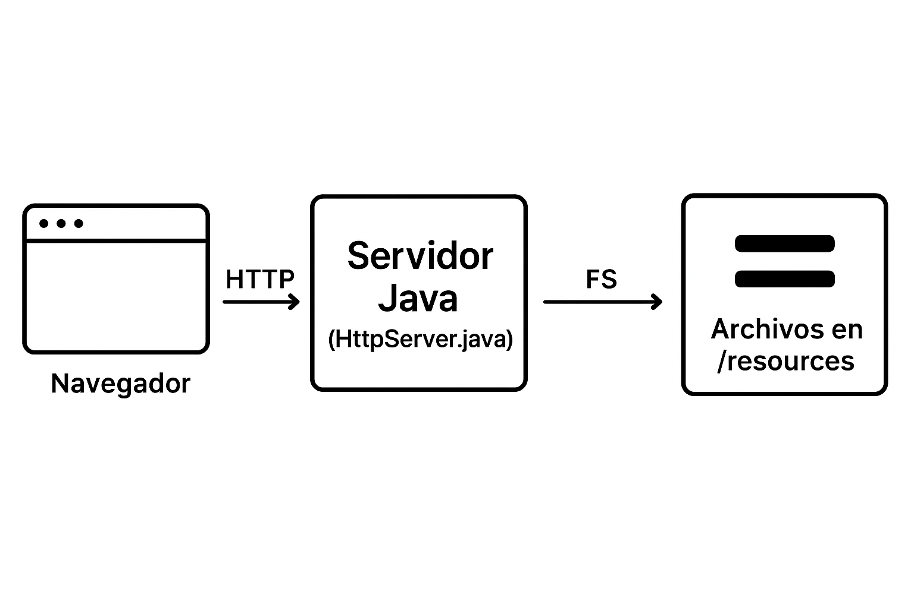

# AREP - Laboratorio 1: Servidor Web en Java
## Descripción

Este proyecto explora la arquitectura de aplicaciones distribuidas, implementando un servidor web básico en Java sin el uso de frameworks como Spring. El servidor es capaz de atender múltiples solicitudes secuenciales (no concurrentes), sirviendo archivos estáticos (HTML, CSS, JS, imágenes) y exponiendo servicios REST para comunicación asíncrona con el frontend.

## Instalación


1. **Clona el repositorio:**
	```sh
	git clone https://github.com/Juan-Rpenuela/AREP_Laboratorio1.git
	```

2. **Compila el proyecto con Maven:**
	```sh
	cd AREP_Laboratorio1
	mvn clean package
	```

3. **Ejecuta el servidor con Maven:**
	```sh
	mvn exec:java
	```
	El servidor escuchará en el puerto `35000`.

---

### Alternativa: Ejecutar sin Maven

1. **Compila los archivos Java manualmente:**
	```sh
	javac -d out -sourcepath src/main/java src/main/java/edu/escuelaing/arep/app/HttpServer.java
	```

2. **Ejecuta el servidor:**
	```sh
	java -cp out edu.escuelaing.arep.app.HttpServer
	```
	El servidor escuchará en el puerto `35000`.

## Uso

- Accede a la aplicación web desde tu navegador en:  
	[http://localhost:35000/](http://localhost:35000/)

- Puedes solicitar archivos estáticos como:
	- `/index.html`
	- `/styles.css`
	- `/app.js`
	- `/ballena.jpg`

- Servicio REST de ejemplo:
		
    - [http://localhost:35000/app/hello?name=Juan](http://localhost:35000/app/hello?name=Juan)
    
    - Este servicio puede ser consumido desde la página principal (`index.html`). Al ingresar un nombre en el formulario de la página, se realiza una petición asíncrona al backend y el mensaje en formato JSON se muestra dinámicamente en la misma página.

## Arquitectura

- **Servidor HTTP:** Implementado en Java puro, escucha en el puerto 35000 y atiende solicitudes secuenciales.
- **Manejo de archivos:** Sirve cualquier archivo ubicado en la carpeta `resources/`.
- **Servicios REST:** Expone endpoints como `/app/hello` que responden en formato JSON.
- **Frontend:** Aplicación web con HTML, CSS y JavaScript que consume los servicios REST de manera asíncrona.





## Evaluación y Pruebas

- Se probaron solicitudes de archivos HTML, CSS, JS, imágenes y JSON.
- Se validó la comunicación asíncrona entre el frontend y el backend usando fetch/AJAX.
- Se verificó el manejo de errores (404, 500) y la correcta entrega de los diferentes tipos de archivos.

## Autor

- Juan Andres Rodriguez Penuela

